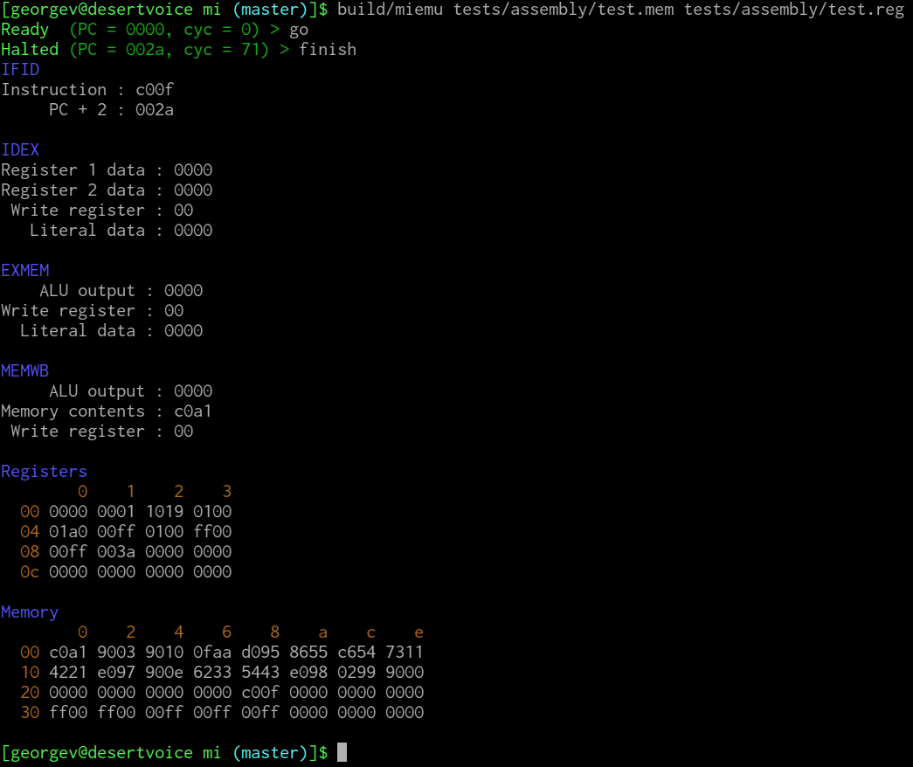

This is a microarchitecture-level emulator for the MIPSsion Impossible processor, a MIPS-style 16-bit processor.

## Cloning
Make sure you get the Google Tests submodule as well by using `git clone --recursive`, or you'll get an error when you try to build.
Alternatively, if you've already cloned the repository, you can use `git submodule update --init` to clone the submodule.

## Compiling

To build, you'll need to ensure you have CMake 3.5 or better installed.
You also need a relatively recent compiler, one that has support for C++14, such as GCC 5.x or Visual Studio 2015.

Aim CMake at the main `CMakeLists.txt` file in this top directory and generate the relevant build files for your compiler.
On Linux, this process would look like this:

    mkdir build && cd build/
    cmake .. -DCMAKE_BUILD_TYPE=Debug

On Windows, you could use the CMake GUI and instead generate Visual Studio project files.

Now you should be ready to build!
On Windows, point Visual Studio to the main solution file created by CMake.
On Linux, execute Make on the main Makefile.

## Structure
The project is currently organized into three main modules:

- the `libmiemu` emulator library that does all the work
- the `miemu` command-line wrapper
- the `tests` unit testing framework using Google Tests.

After you build, you can run `build/miemu` to use the emulator.
The test binary will be at `build/tests/mitests`; running it will run all unit tests.

## Use
To use the emulator, supply an initial memory image and register image on the command line as arguments.
Sample images are provided in `tests/assembly` as `test.mem` and `test.reg`.
So if the build directory is `build`, the emulator could be invoked as:

    build/miemu tests/assembly/test.mem tests/assembly/test.reg

| Command | Possible Arguments                          | Meaning                                                                          |
|---------|---------------------------------------------|----------------------------------------------------------------------------------|
| go      | (none)                                      | Run simulated processor until HALT                                               |
| step    | (none)                                      | Run simulated processor for one cycle                                            |
| show    | IFID, IDEX, EXMEM, MEMWB, Registers, Memory | After each cycle, show the state of the specified data structure                 |
| unshow  | (same as show)                              | Hide the state of the data structure                                             |
| finish  | (none)                                      | Immediately stop the simulation and print the final state of all data structures |

To run a complete simulation, first run `go`, then run `finish`.
Here is sample output from such an execution:

## Resources
- [Google Tests introduction](https://github.com/google/googletest/blob/master/googletest/docs/Primer.md)
- [CMake tutorial](https://cmake.org/cmake-tutorial/)
